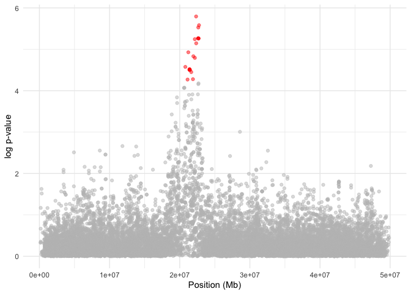
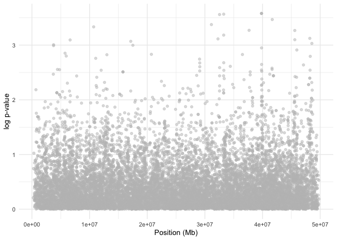

Identificación de señales de selección positiva y análisis de
enriquecimiento funcional
================
Lorena Lorenzo Fernández
2024-05-09

# Identificación de señales de selección positiva

Imaginemos que estamos estudiando una especie rara de mariposas que se
ha descrito recientemente, viven en una cordillera y parecen ocupar dos
hábitats diferentes: una extensión agrícola y una pradera salvaje. Hemos
podido observar que, pese a que las mariposas no presentan diferencias
fenotípicas evidentes, las migraciones de la población salvaje a la
agrícola son poco efectivas, ya que los individuos acaban muriendo o no
se reproducen (reducción del fitness). Sospechamos que la selección
puede estar detrás de esta reducción en el fitness, así que, para
estudiar esta especie, hemos secuenciado a genoma completo 50 individuos
de cada población.

Para analizar si la selección positiva está actuando en estas
poblaciones vamos a utilizar distintas aproximaciones con el objetivo de
contrastar las señales y evitar falsos positivos. Estudiaremos la
**diversidad a lo largo del genoma** de las poblaciones, después
calcularemos el **Fst para medir diferenciación** y finalmente
utilizaremos el **estadísitico iHS** para identificar regiones bajo
selección.

### Cálculo de diversidad (pi y Tajima’s D) y Fst de diferenciación

Si recordamos de la teoría que vimos ayer, la señal que se observa en el
genoma tras un evento de selección positiva es un barrido selectivo por
arrastre de alelos cercanos a la mutación beneficiosa que resulta en una
disminución de la diversidad génica alrededor de la mutación.

Primero vamos a ver qué pinta tiene el vcf que contiene los SNPs de
estas mariposas y a dividirlo por las dos poblaciones que tenemos.

``` bash
# move to the folder we are going to work today
cd practica3

# call the data as a variable
vcf_file="data/data_selection.vcf"

# explore the vcf
less -S $vcf_file # remember to use "q" to close the visualization of the vcf!

# create population files (one line per individual)
grep -m1 "#CHROM" $vcf_file | cut -f10- | tr "\t" "\n" | head -50 > data/data_selection.pop1.txt
grep -m1 "#CHROM" $vcf_file | cut -f10- | tr "\t" "\n" | head -100 | tail -50 > data/data_selection.pop2.txt

# divide vcf per population
vcftools --vcf $vcf_file --keep data/data_selection.pop1.txt \
    --recode --recode-INFO-all --out data/data_selection.pop1

vcftools --vcf $vcf_file --keep data/data_selection.pop2.txt \
    --recode --recode-INFO-all --out data/data_selection.pop2
```

Ahora, calcularemos los valores de pi, Tajima’s D y Fst. Los dos
primeros nos estiman la diversidad genética de cada población mientras
que el valor de Fst nos mide la diferenciación entre poblaciones a lo
largo del genoma.

``` bash

#Calculate pi per population
vcftools --vcf data/data_selection.pop1.recode.vcf \
    --window-pi 50000 --out data/data_selection.pop1

vcftools --vcf data/data_selection.pop2.recode.vcf \
    --window-pi 50000 --out data/data_selection.pop2

#Calculate Tajima D per population
vcftools --vcf data/data_selection.pop1.recode.vcf \
    --TajimaD 50000 --out data/data_selection.pop1

vcftools --vcf data/data_selection.pop2.recode.vcf \
    --TajimaD 50000 --out data/data_selection.pop2
    
#Calculate Fst
vcftools --vcf $vcf_file \
    --weir-fst-pop data/data_selection.pop1.txt \
    --weir-fst-pop data/data_selection.pop2.txt \
    --fst-window-size 50000 \
    --out data/data_selection.pop1_vs_pop2    
```

Una vez que tenemos el resultado de estos valores calculados para cada
SNP, podemos observar en R cómo se ve cada distribución a lo largo del
genoma de las dos poblaciones de mariposa.

``` r
#Read the data
pi_pop1 <- read.table("data/data_selection.pop1.windowed.pi", header = TRUE)
Td_pop1 <- read.table("data/data_selection.pop1.Tajima.D", header = TRUE)

pi_pop2 <- read.table("data/data_selection.pop2.windowed.pi", header = TRUE)
td_pop2 <- read.table("data/data_selection.pop2.Tajima.D", header = TRUE)

# plots for pop1
pi1_plot<- ggplot(data = pi_pop1,
       aes(x = BIN_START, y = PI)) +
  geom_point() +
  geom_smooth(method = "loess", span = 0.2) +
  labs (x="Position (Mb)", y="π", title = "Population 1") +
  theme(plot.title = element_text(hjust = 0.5))

td1_plot <- ggplot(data = Td_pop1,
       aes(x = BIN_START, y = TajimaD)) +
  geom_point() +
  geom_smooth(method = "loess", span = 0.2) +
  labs (x="Position (Mb)", y="Tajimas'D")

# plots for pop2
pi2_plot<- ggplot(data = pi_pop2,
       aes(x = BIN_START, y = PI)) +
  geom_point() +
  geom_smooth(method = "loess", span = 0.2) +
  labs (x="Position (Mb)", y="π", title = "Population 2") +
  theme(plot.title = element_text(hjust = 0.5))

td2_plot<- ggplot(data = td_pop2,
       aes(x = BIN_START, y = TajimaD)) +
  geom_point() +
  geom_smooth(method = "loess", span = 0.2) +
  labs (x="Position (Mb)", y="Tajimas'D")

## customize the plots
plot<- ggpubr::ggarrange(pi1_plot, pi2_plot, td1_plot, td2_plot, 
     ncol= 2, nrow= 2, label.x= "Position (MB)")  

print(plot)
```

<!-- -->

``` r
# Read the data
Fst <- read.table("data/data_selection.pop1_vs_pop2.windowed.weir.fst", header=TRUE)

#Plot fst
fst_plot<- ggplot(data = Fst,
       aes(x = BIN_START, y = MEAN_FST)) +
  geom_point() +
  geom_smooth(method = "loess", span = 0.2) +
  labs (x="Position (Mb)", y="Fst") 

#ggplot(data = Fst,
#       aes(x = BIN_START, y = WEIGHTED_FST)) +
#  geom_point() +
#  geom_smooth(method = "loess", span = 0.2)

print(fst_plot)
```

<!-- -->

### Cálculo de iHS (basado en EHH)

Como ya hemos visto, iHS es un estadístico que mide la asimetría de la
extensión de haplotipos en desequilibrio de ligamiento en dos
direcciones opuestas (ancestral-derivado). Por lo tanto, cuanto mayor
sea la diferencia entre las dos direcciones, mayor será el valor de iHS.

En este caso, vamos a utilizar el paquete `rehh` para calcular iHS en
las dos poblaciones y ver si hay señales de selección positiva en alguna
de ellas.

Empezaremos cargando en R los datos que tenemos para cada población:

Una vez que tenemos los datos para cada población, vamos a proceder a
calcular iHS en cada una de las poblaciones.

``` r
#Scan the genome: this function calculates iHH (integrated EHH, area under EHH curve) and iES (integrated EHH per Site)for each SNP. 
scan_pop1 <- scan_hh(vcf_pop1)

#Calculate iHS values 
ihs_pop1 <- ihh2ihs(scan_pop1, freqbin=0.05 , min_maf=0)
```

    ## Discard focal markers with Minor Allele Frequency equal to or below 0 .
    ## 6863 markers discarded.
    ## 18521 markers remaining.

``` r
#extract candidate SNPs 
ihs_val_pop1 <- ihs_pop1$ihs %>% na.omit() 
candidates_pop1 <- ihs_val_pop1 %>% filter(IHS > 4 | IHS < -4) 

#plot iHS results 
pop1 <- ggplot(data = ihs_val_pop1, aes(x = POSITION, y = LOGPVALUE)) +
          geom_point(alpha = 0.5, color = ifelse(ihs_val_pop1$IHS > 4 | ihs_val_pop1$IHS < -4, "red", "grey")) +
          xlab("Position (Mb)") + 
          ylab("log p-value") +
          theme_minimal()

print(pop1)
```

<!-- -->

``` r
#Scan the genome: this function calculates iHH (integrated EHH, area under EHH curve) and iES (integrated EHH per Site, which forms the basis for cross-population comparisons)for each SNP.
scan_pop2 <- scan_hh(vcf_pop2)

#Calculate iHS values
ihs_pop2 <- ihh2ihs(scan_pop2, freqbin=0.05 , min_maf=0)
```

    ## Discard focal markers with Minor Allele Frequency equal to or below 0 .
    ## 6001 markers discarded.
    ## 19383 markers remaining.

``` r
#extract candidate SNPs
ihs_val_pop2 <- ihs_pop2$ihs %>% na.omit()
candidates_pop2 <- ihs_val_pop2 %>% filter(IHS > 4 | IHS < -4)

#plot iHS results
pop2 <- ggplot(data = ihs_val_pop2, aes(x = POSITION, y = LOGPVALUE)) + 
        geom_point(alpha = 0.5, color = ifelse(ihs_val_pop2$IHS > 4 | ihs_val_pop2$IHS < -4, "red", "grey")) + 
        xlab("Position (Mb)") + 
        ylab("log p-value") +
        theme_minimal()

print(pop2)
```

<!-- -->

# Enriquecimiento funcional

Si en lugar de tener una señal de selección particular tenemos muchos
posibles outliers para nuestros análisis de selección a lo largo del
genoma, estaremos buscando eventos de selección poligénica.

Por tanto, como comentamos ayer en la teoría, al cruzar nuestros
outiliers con la anotación del genoma de referencia que estemos usando,
tendremos una **lista de genes candidatos.** Con esto, podemos testar si
en nuestra lista de genes hay **funciones representadas por exceso o por
defecto** a lo que cabría esperar en una muestra aleatoria de genes.

Para este ejercicio, supondremos que tenemos una lista de genes
candidatos en lince ibérico mapeado al genoma del gato. Lo primero que
tenemos que hacer es cargar desde ensembl nuestra anotación (Felis
Catus) y extraer la información que vamos a necesitar (en nuestro caso
el ensembl ID, gene name y GO ID.

*Tened en cuenta que en los ordenadores del LAST, por la versión de R
que manejan, no permiten usar el paquete bioMart para acceder a la base
de datos de ensembl, por eso lo que vamos a hacer es guardar todos estos
datos en un dataframe para que en caso de que no hayamos podido
generarlos podamos utilizarlos igual.*

``` r
#####Get annotation from ensembl.org#####

#download from ensembl.org every felcat ensembl ID:
ensembl <- useMart("ensembl", dataset = "fcatus_gene_ensembl")

#extract the GOterms for every ensembl_id
ensembl_to_go <- getBM(attributes = c("ensembl_gene_id", "external_gene_name", "go_id"), mart = ensembl)

write.table(ensembl_to_go, file="data/felcat_annotation.csv", sep=",", row.names = F)
```

Por tanto, si no hemos podido generar esa tabla con la información de la
anotación del gato, podemos cargarla directamente ya que está disponible
en los datos de la práctica 3 como `felcat_annotation.csv`.

``` r
# read emsembl data of Felcat annotation
ensembl_to_go <- read_csv("data/felcat_annotation.csv", show_col_types = FALSE)

#make a list with every GO terms per gene name. 
go_list <- split(ensembl_to_go$go_id, ensembl_to_go$external_gene_name)

#Comment: So, the annotation has a total of 16382 genes, more information of the cat annotation available here: https://www.ensembl.org/Felis_catus/Info/Annotation

# read my list of candidate genes
genes <- read.csv("data/candidate_genes.csv")
genes <- genes$x
```

Una vez que tenemos las dos bases de datos que queremos comparar
(nuestros genes candidatos y todos los genes de la anotación de nuestra
especie), podemos proceder con el análisis de enriquecimiento funcional,
para lo cual usaremos el paquete `topGO` .

``` r
#cross the felcat annotation (ensembl_id with its GOterms) with my set of genes, to get a logical factor of true (if the gene is in the set) and false (if its not)
allgenes <- factor(as.integer(names(go_list) %in% genes))
names(allgenes) <- names(go_list) #names of allgenes are names of go_list

#####Creating the topGOdata object#####
godata <- new("topGOdata", ontology = "BP", allGenes = allgenes, 
              annotationFun = annFUN.gene2GO, gene2GO = go_list, nodeSize=10)


#####run the overrepresentation test#####
over_test <- runTest(godata, statistic = "fisher") 

# Comment: fisher test is based on gene counts while Kolmogorov-Smirnov is based on gene scores, which better fits transcriptomics studies

# represent the results of the test in a table
result_table <- GenTable(godata, Fisher=over_test, topNodes=over_test@geneData[2], numChar=1000) %>% 
        as_tibble() %>% 
        mutate(p.adj = round(p.adjust(as.numeric(gsub("<", "", Fisher)), method="BH"), 4), ontology= "BP") %>% 
        filter(p.adj<0.05) 
```

| GO.ID        | Term                                             | Annotated | Significant | Expected | Fisher |  p.adj | ontology |
|:-------------|:-------------------------------------------------|----------:|------------:|---------:|:-------|-------:|:---------|
| <GO:0051607> | defense response to virus                        |       211 |          11 |     1.47 | 1e-06  | 0.0001 | BP       |
| <GO:0080111> | DNA demethylation                                |        21 |           3 |     0.15 | 0.0004 | 0.0186 | BP       |
| <GO:0045071> | negative regulation of viral genome replication  |        34 |           3 |     0.24 | 0.0017 | 0.0465 | BP       |
| <GO:0097152> | mesenchymal cell apoptotic process               |        10 |           2 |     0.07 | 0.0021 | 0.0465 | BP       |
| <GO:0060337> | type I interferon-mediated signaling pathway     |        47 |           3 |     0.33 | 0.0030 | 0.0465 | BP       |
| <GO:0006177> | GMP biosynthetic process                         |        12 |           2 |     0.08 | 0.0030 | 0.0465 | BP       |
| <GO:0070131> | positive regulation of mitochondrial translation |        14 |           2 |     0.10 | 0.0041 | 0.0496 | BP       |
| <GO:0030202> | heparin metabolic process                        |        15 |           2 |     0.10 | 0.0048 | 0.0496 | BP       |
| <GO:0035458> | cellular response to interferon-beta             |        15 |           2 |     0.10 | 0.0048 | 0.0496 | BP       |
